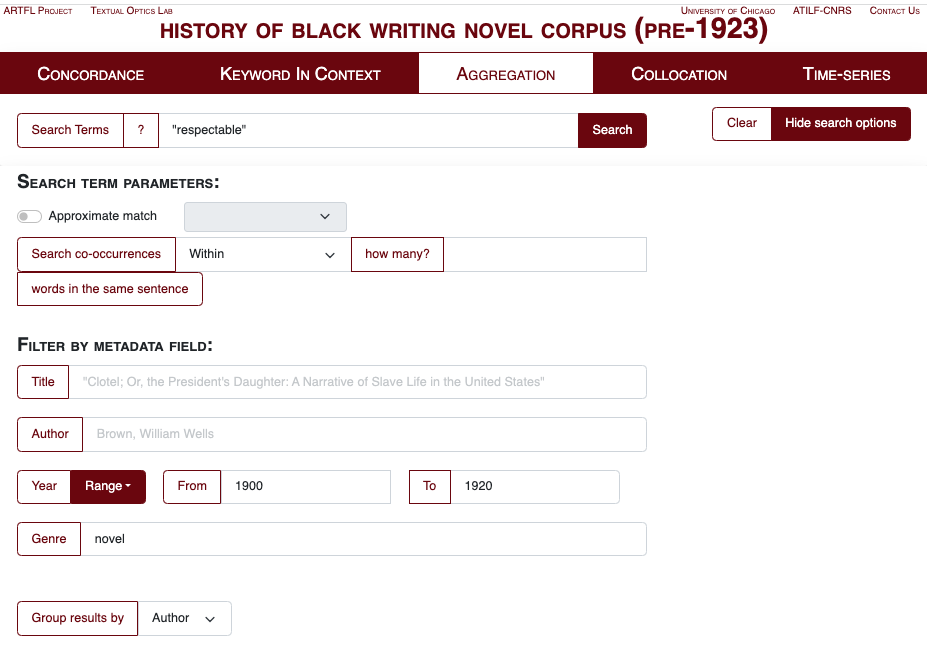

# Project Report: Creating, Curating, and Using the “History of Black Writing Scholar-Curated Workset for Analysis, Reuse, and Dissemination”

**Maryemma Graham, Jade Harrison, Ashley Simmons, Brendan Williams-Childs (HBW)**

## Introduction

The HathiTrust Research Center (HTRC) partnered with Dr. Maryemma Graham as co-PI on the Mellon-funded project “Scholar-Curated Worksets for Analysis, Reuse & Dissemination” (SCWAReD).  Dr. Graham and her [History of Black Writing](https://hbw.ku.edu/) (HBW) team at the University of Kansas served as the flagship research collaboration in the larger SCWAReD project.  As the “Workset” part of the project title implies, one of the primary goals of the SCWAReD project was to create and deploy a sharable and reusable HBW Workset within the HTRC ecosystem.  This we have done, and the methodologies and affordances of it are described in the accompanying [Introduction](introduction.md) to the History of Black Writing Workset. 

While this Workset clearly embodies one of HBW’s core activities – the innovative scholarly publishing of primary sources – it is neither the first such publishing project nor the only aspect of HBW’s wide-ranging work (in addition to creating and curating the most comprehensive known bibliographic database of African-American literary texts, the work for which it may be best known).  This Project Report describes other aspects of HBW’s collaboration with HTRC in two main areas – HBW’s previous digital publishing efforts, and its commitment to student engagement – which we hope may serve as the context in which the SCWAReD Workset came to be, and has come to be understood (including some of its limitations, which we believe are important to acknowledge).

## 1: Scholarly Publishing Projects in the History of Black Writing

HBW’s engagement with digital methods began with the first computerized bibliography of 800 novels identified by collectors before the 1970s including Jesse E. Moorland, Arthur B. Spingarn, Arthur A. Schomburg, Henry P. Slaughter, Carl Van Vechten, Charles F. Heartman, Willis D. Weatherford, and Clarence L. Holte.  These were titles mostly in repositories that we could access and verify with records in Library of Congress and OCLC during the last 1980s. Historical sources like Monroe Work’s _Negro Yearbook_[^1] were useful especially for early works that had not been included by others. In addition to the work of Dorothy Porter Wesley, among the earliest to give attention to developing systematic archives, a generation of Black librarians and archivists began to appear after the 1970s and to produce dedicated Black Bibliographies that allowed us to confirm with at least three sources an author’s identity and basic bibliographical data. During the period often referred to “From Famine to Feast,” we acquired a report “Pre-1950 Authors: A Checklist Compiled by the African American Materials Project,” prepared by Geraldine Matthews, Associate Director of a project funded by the US Office of Education.[^2]  This first major effort to identify materials by and about African Americans within the holdings of Higher education institutions in the South provided the impetus for the future work that we were able to do.   In 1982, additional information also came from “The Black Periodical Fiction Project 1827-1919,” by Henry Louis Gates, Jr., which provided a checklist for authors who went on to publish in book form.  By 1989, we were able to secure funding from the National Endowment for the Humanities for “The Afro-American Novel Project: Building a Database for African American Literature.” Students under the leadership of late librarian Barbara Ann Hunt at the University of Mississippi were responsible for completing the first phase of the HBW Corpus.  

Experimentation with an early visualization project led to the production of a first hypertext edition of _Bond and Free: A True Tale of Slave Times_, by James H.W. Howard (1886)[^3] in 1997, an essential next step in expanding HBW’s digital profile. Relocation to the University of Kansas in 1998 allowed for the development of a more systematic, sustainable approach for organizing and describing HBWC. In addition, HBW partnered with reprint efforts to return collections of books to circulation, including the Schomburg Series of Black Women Writers.  HBWC also supplied the text of novels published between 1853 and 1923 for _Encarta Africana_, a 1999 CD-ROM encyclopedia of Black history and culture. Individual requests for texts began to increase, which were responded to manually. These early efforts suggested what was possible with increased use of technology as well as the need for greater access for scholars and educators.

The full-text HBW Corpus is divided into two collections – a fully accessible, pre-1923 database including titles in the public domain, and a limited-access, post-1928, both with access through a [Philologic search interface](https://artflsrv04.uchicago.edu/philologic4.7/history-black-writing_pre1923/) developed by the [Textual Optics Lab](https://textual-optics-lab.uchicago.edu/) at the University of Chicago. To increase the usability of the Corpus, the continued application of an custom-designed metadata schema allows for both simple and complex search functionality (see Figure 1). Since most of HBWC is rarely cataloged or identified elsewhere if at all, the more systematic approach provides bibliographical and author data, broad genre categories, as well as information on language, style, setting, subject, and historical period.  

_Figure 1. PhiloLogic search interface hosted at the University of Chicago Textual Optics Lab._

Between 1985 and 2010, while HBW has been a mainstay in research and scholarship through its professional and public humanities activities,  the HBW Corpus has been primarily available to graduate students and NEH summer scholar participants in funded institutes.  By 2010, we began to explore ways for expanding access using digital methods.  In 2012, we created the [Black Book Interactive Project](http://bbip.ku.edu) based on a pilot project led by then graduate student Kenton Rambsy[^4] and began the partnership with the University of Chicago described above. NEH funding in 2016 allowed us to work on a dedicated metadata that paid closer attention to differences of race and culture, followed by the creation of a BBIP scholars program to build a more inclusive DH Community and to expand the user population for HBWC.  Grants from ACLS and NEH have expanded the BBIP cohort community, produced a curriculum for training DH professionals, increased the HBWC, and provided guided publishing opportunities. In 2021, Andrew W. Mellon also funded The Black Literature Network: Building Knowledge through a Digital Media Datasphere _(Black Lit.Net_), that builds on previous work done by Howard Rambsy[^5] and Kenton Rambsy.  Black Lit.Net will transform HBWC into content-rich multimedia information portals for increased public engagement by creating a _Novel Generator Machine_ (Portal 1); the _Literary Data Gallery_ (Portal 2); _Multithreaded Literary Briefs_ (Portal 3); and a _Podcast series_ (Portal 4). Additional content will be available through a searchable _Current Archives and Collections Index_ of Black-themed collections and the _Data Rangers Fellowship Program_, a pipeline opportunity for undergraduates and early-career graduate students with limited access to DH training.    

## 2. HBW and HTRC under the SCWAReD Umbrella

The SCWAReD project offered an unparalleled opportunity for close collaboration between the Project on the History of Black Writing and the HathiTrust Research Center – one that we believe was mutually and equitably beneficial to both our organizations.  For HBW, the collaboration enabled a new and different venue for experimentation with evolving digital methods very much in the tradition of BBIP and our collaboration with the Chicago Textual Optics Lab.  For HTRC, the collaboration provided not only valuable subject expertise and an entrée into the field of Black DH, but also an opportunity to gain new perspectives into the HathiTrust collections, allowing new explorations into the crucial question of how “complete,” how “comprehensive” they are.  

The primary focus of the HBW-HTRC SCWAReD collaboration was the creation of the HBW Workset, which is described in much greater detail in its [Introduction](introduction.md).  Very briefly, the collaborators were able both to assemble a Workset of nearly 2,000 volumes of Black-authored fiction that is now available for further research; and to identify, analyze, and begin to fill crucial gaps in the HathiTrust collections through targeted digitization.

One important aspect of HTRC worksets generally, also available in the HBW Workset, is enhanced computational access, which applies equally to in-copyright works and to copyright-free works. This is possible thanks to HTRC’s implementation of its so-called “non-consumptive use policy” – in contrast to the HBW Corpus offered through Philologic, which is by necessity divided into distinct open-access and restricted collections, as described above.

Finally, the project brought HTRC into close collaboration with three early-career researchers who pushed the limits of its digital collections and methodologies, and inspired important reflection on how to improve them.  We turn now to a description of those research projects, which were undertaken simultaneously with the creation of the HBW Workset, and how they challenged those HTRC collections and methodologies.

## 3. Sample Projects

### i. Black Vernacular English in 20th Century Black Women’s Fiction.
**by Jade Harrison**[^6]

In Spring 2021 I began a project with the HBW workset on “Black Vernacular English in 20th Century Women’s Fiction.” The project serves as a digital entry point for tracing the use and evolution of Black Vernacular English usage in African American women’s fiction throughout the 20th century. Nine novels authored by African American women were selected from the HBWC to create a focused workset: Frances E.W. Harper’s _Iola Leroy: Shadows Uplifted_ (1892); Zora Neale Hurston’s _Jonah’s Gourd Vine_ (1933), _Their Eyes Were Watching God_ (1937), and _Seraph on the Suwanee_ (1948); Margaret Walker’s _Jubilee_; (1966) Alice Walker’s _The Color Purple_ (1982); Toni Morrison’s _Beloved_ (1987); Sherley Anne Williams’s _Dessa Rose_ (1990); and Sapphire’s _Push_ (1996). The novels selected from the HBWC each contain a strong presence of African American Vernacular English (AAVE), or non-standard English demonstrated through character dialogue or narrative form. I chose novel genres I believed were more likely to contain AAVE or non-standard English based on Black literature-specific genres and themes that had been identified by the data collection efforts of HBW’s Black Book Interactive Project team. The selected texts include historical novels about slavery, neo-slave narratives, and epistolary novels. This workset combines bibliographic (original publication titles, original publication dates), biographic (author names, author sex), linguistic (word densities, word types, number of  lines spoken), geographical (novel settings), textual (character race, character sex, character types), along with historical data to create a starting point for users who seek to trace and analyze language variations and the resilience of Black Vernacular English usage across select African American women’s novels. 

I utilized [Voyant Tools](https://voyant-tools.org/) to identify linguistic features of each text such as word densities, number of word types, and number of lines spoken for each character. First, I selected preexisting PDF versions from the HBW workset and converted them to HTML files using ABBYY FineReader software. Then, I extracted character dialogue from those novels that engage a third-person limited or omniscient narrative mode, using a combination of manual and automated processes, before inserting the text into Voyant. (I was not able to extract “dialogue” from the two novels that engage a first-person narration mode, specifically Alice Walker’s _The Color Purple_ and Sapphire’s _Push_, since both novels are written in epistolary form. The anticipated data findings were that Zora Neale Hurston’s two novels, _Jonah’s Gourd Vine_ and _Their Eyes Were Watching God_, would contain the highest numerical word densities and word types (that is, highest language variation) due to the substantial amount of dialogue between characters throughout each narrative. Engaging third-person limited or omniscient narrative modes, Hurston frequently utilizes communal settings located in the U.S. South throughout her novels in which Black characters engage in constant dialogue. The continuous dialogue, or back-and-forth, between characters throughout these two novels offers an opportunity to analyze how characters speak to each other. Moreover, I also expect Alice Walker’s _The Color Purple_ and Sapphire’s _Push_ as two novels that will have higher word densities and word types in comparison to the other selected novels due to these narratives being written in AAVE and narrated in the first person; Walker’s novel is an epistolary novel that utilizes southern AAVE (Georgia), while Sapphire’s novel utilizes a northern iteration of AAVE (New York). The main protagonist in each novel narrates the respective story using AAVE terms and phrases; however, the usage of AAVE differs due to geographical location. 

This project’s data collection and analysis have required a substantial amount of time. Converting the novel PDF files to HTML required the most time. While ABBYY FineReader is mostly automated, sometimes the software cannot accurately detect certain fonts or symbols in a text. At times, accuracy suffered due to the poor overall quality of scanned PDF files. Therefore, some of the converted HTML files required a good amount of manual revision before I could analyze the necessary data using Voyant Tools.

### ii. Analysis of Black-Authored Fiction in Trade and Vanity Publishing
**by Brendan William-Childs**[^7]

In Fall, 2021, my interest in vanity publishing, also called subsidy publishing, led me to consider a comparative study in this area.  Vanity publishing is a business model in which authors pay to have their work printed by a publishing house that may or may not offer them marketing or distribution support after the fact. In the world of literature, vanity publishing, even more so than self-publishing, is seen as something of a last resort, and one that should be avoided. Many vanity publishers in the United States ceased operation by the late 1990s-early 2000s over legal investigations into the practice of misleading authors who paid to be published, but not before producing a wide variety of books from an equally wide variety of authors. During the mid-20th century vanity publishing was an apparently reliable, if not lucrative, method for authors to produce printed books despite a publishing landscape that was, and remains, hostile to Black authors in the United States. 

While the landscape of publishing is frequently changing, an author who publishes with a major house (Simon & Schuster, Penguin/Random House, etc.) is, and was, more likely to be seen as “legitimate” than an author who self-publishes or publishes with a vanity press. This tiered perception of author success may additionally create a tiered perception of the quality of the work itself, with suggestions that works published by vanity publishers are less carefully crafted or markedly different, textually, than traditionally published works. With this in mind, this workset asks the question, “what, if anything, differentiates the language of vanity publications and trade publications?” 

I began by reviewing a small selection of HBW volumes (122 in total), published between 1960 and 1981. Earlier concepts of this project included more titles, but after correcting some mistakes (such as miscategorizing independent publishers or self-published works as vanity publications) and cleaning data, 121 volumes remain. 

The period of 1960-1981 slightly precedes and mostly encompasses the Black Arts Movement, and while the selection of volumes in the workset obviously does not include every book by Black authors published during these twenty years, the random selection offers a broad scope of titles across publishing houses and vanity publishers. Notable authors published by trade publishers present in this selection include Hal Bennett (_The Black Wine_, 1968), Frank Yerby (_The Dahomean_, 1971), and Kristin Hunter (_The Landlord_, 1966). Authors published by vanity presses are less widely known and slightly less likely to publish multiple titles. Select authors published by vanity presses include: Minnie T. Shores (_Publicans and Sinners_, 1960) James A. Mays (_Chameleon_, 1978), Lawrence Briscoe (_Fisher’s Alley,_ 1973), and Hari Rhodes (_The Hollow and the Human_, 1976.) 

In this workset, I examined 51 vanity publications and 70 trade publications. For the purposes of this workset, “trade” refers only to “Big Five” publishers and their imprints (Penguin/Random House, Hachette Book Group, Harper Collins, Simon & Schuster, and Macmillan). Despite this limitation, there is still a surprising amount of diversity in trade publication imprints – no single trade publisher is dominant within its category. In vanity publishing, however, Vantage Press stands out as the most prolific – a full 27 of the 51 vanity titles were published by Vantage (followed by Exposition Press and Carlton Press’ imprint Geneva Books). The workset does not include independent publishing groups that would later be subsumed by those Big Five. That absence notably leaves out independent Black publishers, such as Holloway House, which are sites of potential future stylistic analysis either as separate projects or in comparison to this preliminary project. 

I selected only those volumes that had undergone three rounds of manual metadata collection and accuracy-checking by HBW staff for this workset. Of the total 121 volumes, 56 were already included in the HathiTrust Library. Of the 65 total volumes that were not in HathiTrust, 26 were trade (and included notable authors such as Robert Deane Pharr), and 37 were vanity. The disproportionate number of vanity volumes not available in HathiTrust – due in part to academic libraries’ inclination not to collect them – delayed the line-level analysis, which is ongoing.

Ongoing analysis of this workset relies on stylometry, following an extant stylometric model originally developed by Nicholas Kelly, Loren Glass, and Nikki White at the University of Iowa, in a 2017 collaboration with HTRC.[^8]_ I used this model on this workset to compare prose style differences including sentence length, originality of words, and part-of-speech proportions (relative numbers of nouns, adjectives, etc.) between texts. While the limited number of volumes analyzed necessarily produces limited results, this workset represents an initial foray into a specific, understudied mode of literary production in Black writing. 

While the specific stylometric outcomes are not yet available for review, preliminary findings of the workset, based on close manual reading, indicate little to separate the work of Black authors across publisher types based on theme/topic alone. The most notable exceptions appear to be that faith-based narratives are slightly more common in vanity publishing (with detective fiction being slightly more common in trade fiction) and a slightly higher number of women authors are present in the selected vanity publication titles. 

Future sites of analysis may include comparison with the workset of Jade Harrison (see above), comparison with a corpus of independent Black publications such as Holloway House, comparison with a corpus of random (not specific to HBW) vanity published titles, or a historic analysis of the content and style of the titles that were once independent but have since been become part of the Big Five (which in 2021 became the Big Four with the acquisition of Simon & Schuster by Penguin/Random House), or a study on the styles of authors whose work started in vanity and then later became traditionally published. Additionally, Dan Sinykin and Edward Roland’s work on publishing conglomeration and the influence of individual editors (published as “Against Conglomeration: Nonprofit Publishing and American Literature After 1980”[^9]) could serve as a model for further determining how white (or, rarely) Black editors influenced the voice and style of Black authors in the mid to late 1900s. 

### iii. Mapping Respectability in African American Literature 1890-1910
**by Ashley Simmons**[^10]

Respectability and what it means to Black people in the United States is a controversial concept that continues to shape our attitudes, manners, and presentation to a larger (mainly white) audience. After the Civil War and Reconstruction periods, Black writers contemplated characteristics Black people should adopt to become productive members of society in their new post-emancipation world. For this workset, I used the two chapters “The Female Talented Tenth” and “The Politics of Respectability” in Evelyn Brooks Higginbotham’s 1994 book_ Righteous Discontent: The Women's Movement in the Black Baptist Church, 1880-1920 _(in addition to supplemental works such as W.E.B. DuBois’s 1903 essay “The Talented Tenth”) as a retroactive historical framework for a particular type of fictional text created by Black authors at the turn of the twentieth century. Since “respectability” is a phrase coined in contemporary criticism to describe the mission of social and religious movements in the late nineteenth and early twentieth centuries, this focused workset seeks to utilize this framework to identify literature that also encapsulates the attributes of respectability. Ultimately, I hope this collection can be a foundation for understanding the literary arm of Higginbotham’s historical analysis.

To identify common themes without reading through the entirety of the HathiTrust database, I used Voyant, an open-source, online text analysis word mining online tool, to create a map of the most frequently used words in three titles I believed fit within the parameters of respectability: _Contending Forces_ (1900) by Pauline Hopkins, _Iola Leroy_ (1892) by France E.W. Harper, and “The Talented Tenth” (1903), an essay by W.E.B. DuBois. Though these titles differed in genre, I hoped that the texts would reveal words that aligned with what it meant to be respectable in the late nineteenth and early twentieth centuries. I would then use these words as search terms in the HathiTrust database to discover more titles. Unfortunately, the word maps showed no relation strong enough to utilize in the search. Instead, I was compelled to search for titles with suggestions from professors and colleagues who were more familiar with literature during this time. From those suggestions, I was able to cull HathiTrust for more titles. 

 A total of nineteen novels, religious texts, memoirs, and nonfiction books are included in this focused workset that, together, create a composite of the ideal (or “respectable”) Black American person at the turn of the twentieth century. Texts include  _A Voice From the South_ by Anna J. Cooper, and Julia A.J. Foote’s autobiography _A Brand Plucked from Fire_. 

Though I am still working on reading and analyzing the data from the collection, I have concluded that though the texts in the collection do indeed have respectability themes, how each author chose to write about respectability differs significantly. I approached this collection with the thought that these titles would share common forms and themes like slave narratives. However, because respectability as a term was not defined until the 1990’s, there is no set of common recognizable features. Therefore, this collection does not reflect a collective identity or purpose late nineteenth- and early twentieth-century authors shared, but rather a way contemporary critics can group these titles for present use.

## 4. Project Conclusions

As noted above, the HBW SCWAReD project involved many simultaneous activities that both enhanced and challenged one another, and greatly affected project outcomes.  The labor of converting the decades-long bibliographic work of HBW into an HTRC Workset, while mostly straightforward, eventually revealed collection gaps that negatively impacted the application of the Workset to some of the student research projects.  Some of that negative impact can be traced to the simultaneity of workset-building activities and the pursuit of research questions; ultimately, however, the biggest impediment was the uncovering of collection gaps – books “missing” that might otherwise have contributed to specific research objectives.  This in turn may serve as one of the most important overall lessons of the HBW SCWAReD project: like HBW itself, SCWAReD and HTRC should focus on the recovery of lost, missing, and marginalized writings.

Of course, there were also many unambiguously positive outcomes from this project: the HBW Workset adds an important new type of content, with altogether new research methods, to the HBW ecosystem, which started with a bibliography focused on discovery and recovery of Black-authored fiction. This eventually led to both library-based and “artisanal” project-based digitization; then to modern full-text indexing and sophisticated searching enabled by the University of Chicago’s Philologic interface; and now to the fully open-access text-mining affordances of HTRC, which will soon be joined by the multimedia platform and portals of _Black Lit.Net_ as the newest members of the rich HBW ecosystem.

We hope that our account of these project experiences and outcomes will be instructive for future researchers, and that the SCWAReD HBW Workseet we have curated will find innovative uses in their hands.

<!-- Footnotes themselves at the bottom. -->
## Notes

[^1]:
     Monroe Nathan Work published _Negro Yearbook: An Annual Bibliography of the Negro_, with Annual editions: First; 1912; Second: _1913_; Third: _1914–1915_; Fourth: _1916–1917_ ; Fifth: _1918–1919_; Sixth: _1921–1922_; Seventh: _1925–1926_ ; Eighth: _1931–1932_; Ninth: _1937–1938_

[^2]:
     Geraldine O. Matthews also published _Black American Writers: 1773-1949: A Bibliography and Union List_ (GK Hall, 1975).

[^3]:
     Howard’s rare book _Bond and Free_ has now been reprinted several times since 2011, but information about the author remains sketchy

[^4]:
     Currently Associate Professor of English and African American Studies at the University of Texas, Arlington, and author of _The Geographies of African American Short fiction_ (Mississippi, 2022)

[^5]:
     Currently Distinguished Research Professor in the Department of English, Southern Illinois University, Edwardsville. His latest book is _Bad Men; Creative Touchstones of Black Writers_ (Virginia, 2020)

[^6]:
     Harrison is Co-Coordinator of the HBW’s Black Book Interactive Project and an ABD candidate in English at the University of Kansas

[^7]:
     Williams-Childs is Co-Coordinator of HBW’s  Black Book Interactive Project and served as Project Liaison for SCWAReD.  He is in his third year of the MFA Project at KU, focusing on fiction.

[^8]:
     Stylometry, a statistical analysis of literary style, can be used to compare texts to other texts.  The Iowa work is described in a blog post by Nicholas M. Kelly, “The Program Era Project and HathiTrust,” available at https://newreadia.wordpress.com/2017/11/17/the-program-era-project-and-hathitrusts-advanced-collaborative-support-award/.

[^9]:
     _Post45_, Issue 7. https://post45.org/2021/04/against-conglomeration-nonprofit-publishing-and-american-literature-after-1980/

[^10]:
     Simmons is the archives coordinator for HBW and an ABD student in English at the University of Kansas.
